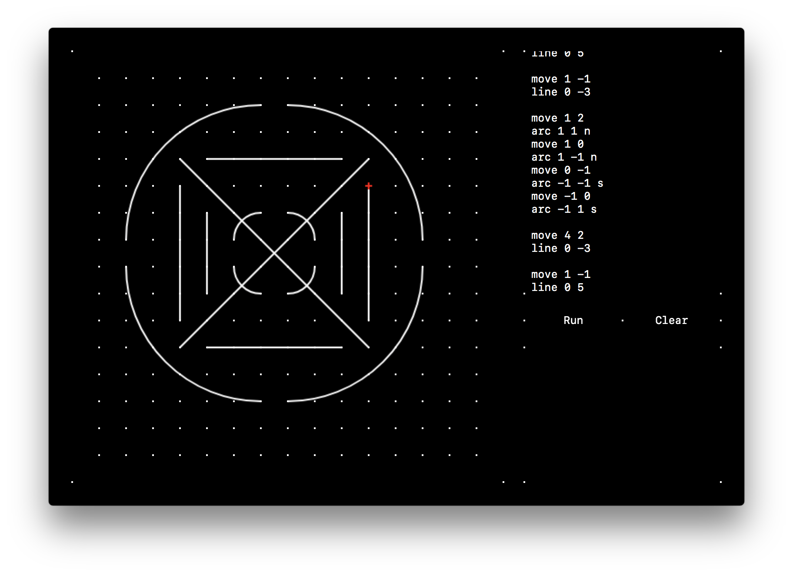
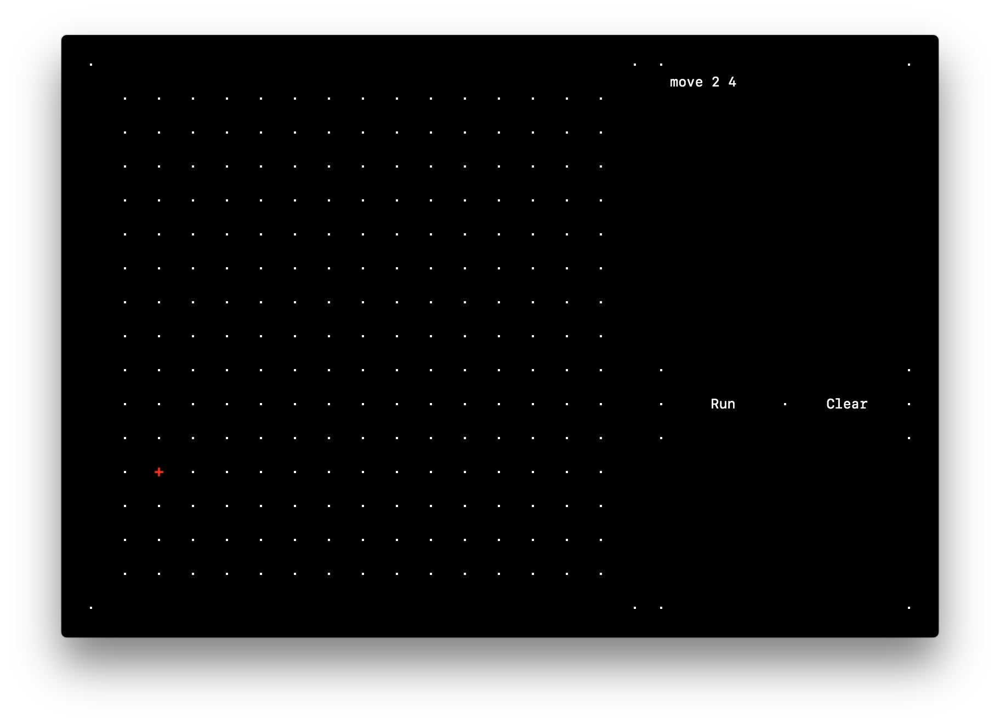
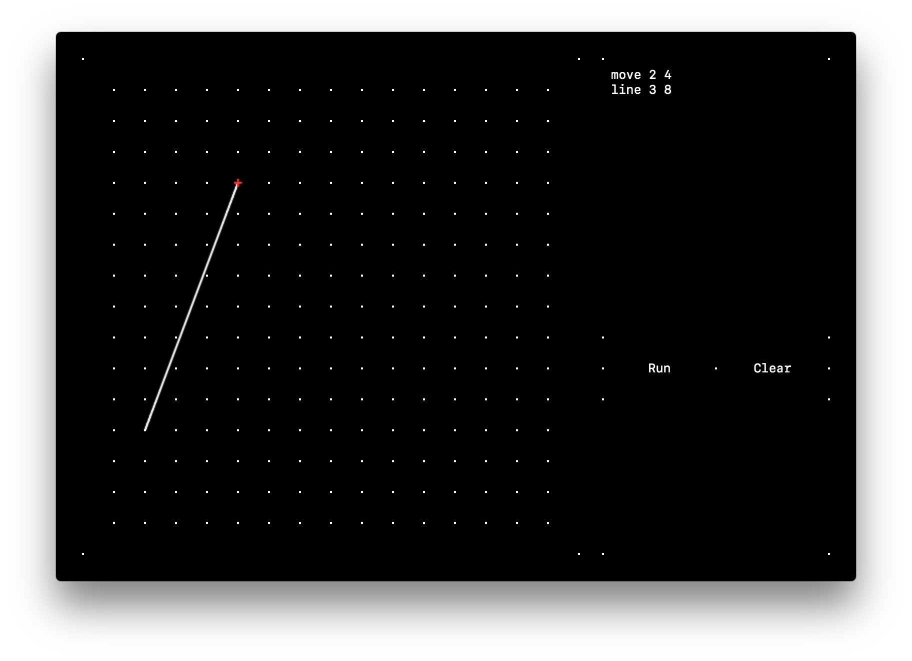
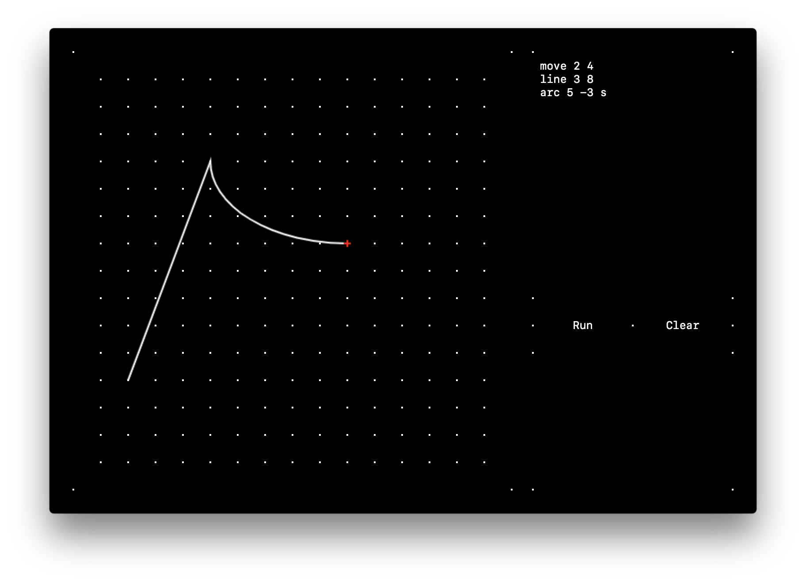

# graphite
Graphite is an electron-based app that takes simple, procedural, LISP-like code (without the parentheses so far) to create graph-like line drawings.




## Writing Code
Most commands take the form of:
```
function x y ...args
```
where `x` and `y` are offset units (more below). Some commands will accept more arguments in addition to `x` and `y`.

### Co-ordinate System
graphite uses the basic Cartesian co-ordinate system, where the bottom left corner is `(0, 0)`; positive `x` is right and positive `y` is up.

Drawings always start at `(0, 0)` as shown by the red cursor, which moves as the drawing is constructed.

`x` and `y` arguments are offsets from the previous `x` and `y` co-ordinate, not co-ordinates themselves. For instance, `move 3 4` will move the cursor `4` units to the right and `3` units up.

### `move`
The `move` command moves the cursor by the `x` and `y` offset.

Moving cursor 2 units to the right and 4 units up:
```
move 2 4
```




### `line`
The `line` command draws a line from the current cursor co-ordinate to the offset specified by the `x` and `y` offset.

Drawing a line from current cursor co-ordinate to 3 units to the right and 8 units up:
```
line 3 8
```




### `arc`
The `arc` draws an arc from the current cursor co-ordinate to the `x` and `y` offset. The command takes a third non-optional argument: the `direction` of the arc, either `n` (north / concave) or `s` (south / convex).

Drawing a concave arc from cursor to 5 units to the right and 3 units down:
```
arc 5 -3 s
```


